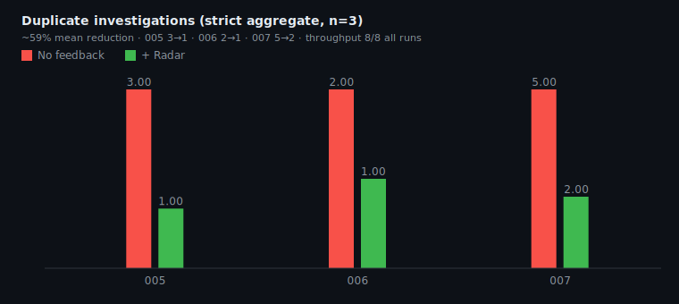
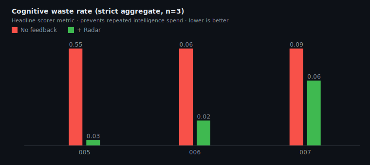
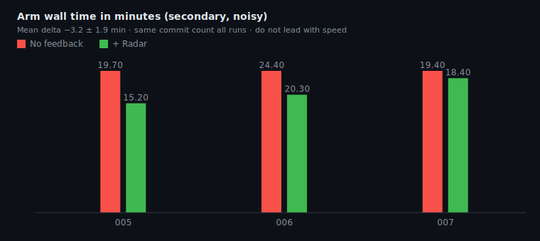
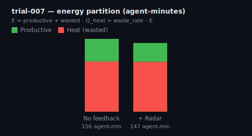

# Blaze Radar Harness

## In 30 seconds

1. **Question:** If parallel coding agents share a notes board, do they stop redoing each other's investigations?
2. **Method:** Run the same swarm twice - once **with** [Blaze Radar](https://github.com/Mikedan37/blaze-radar), once **without** - then score both runs.
3. **Result (n=3 clean trials):** **~59% fewer duplicate investigations**, **8/8 commits every run**. Radar prevents repeated intelligence spend, not assignment.
4. **This repo:** Scripts to run that experiment and math to compare the results. Not Radar itself. Not a leaderboard.

---

## Headline result (strict aggregate, n = 3)

> **Blaze Radar reduced duplicate AI investigation by ~59% across three 8-agent coding trials while maintaining throughput.**

| Trial | Duplicate topics (no-radar → radar) | Commits (both arms) |
|-------|-------------------------------------|---------------------|
| 005 | 3 → 1 | 8 / 8 |
| 006 | 2 → 1 | 8 / 8 |
| 007 | 5 → 2 | 8 / 8 |
| **Mean** | **~59% reduction** | **held** |

**Lead with duplicates, not speed.** Wall clock improved in all three runs (−4.5, −4.1, −1.0 min; mean **−3.2 ± 1.9**). Good direction, noisy.







Full trial log: [docs/EMPIRICAL_RESULTS.md](docs/EMPIRICAL_RESULTS.md).

---

## Hypothesis

**If agents can read a shared board** (tasks, notes, what was tried and abandoned), **they will waste less time re-investigating the same problems** while **still shipping at the same rate**.

This is **organizational memory**, not coordination. Radar does not assign work, block edits, or merge branches. It publishes discovered facts so agents stop paying the same investigation cost twice.

| Good outcome | Bad outcome |
|--------------|-------------|
| Same commits, fewer duplicate investigations | Fewer commits (agents scared off) |
| Agents cite board notes and pivot | Agents ignore the board |
| Duplicate topics drop | Throughput collapses to hit zero duplicates |

---

## Conclusion so far

| Verdict | Detail |
|---------|--------|
| **Headline** | **Supported (n=3).** Duplicate investigations down ~59% across isolated A/B trials 005-007. Throughput 8/8 every run. |
| **Mechanism** | **Supported.** Agents read the board and change course (qualitative traces in 005, 007). |
| **Primitive vs UI** | **007 is the key point.** Misleading board v1.0 UI, still dups 5→2 and context 11→13. Data layer works before presentation is good. |
| **Speed** | **Secondary.** All three runs faster with Radar; high variance. Do not lead the pitch with wall clock. |
| **Not claimed** | Solved coordination, automatic merging, or proof at 16+ agents. Presentation v1.1 effect (trial 008) still open. |

**Plain read:** Eight smart agents without Radar build eight private realities and overlap on discovery. With Radar they share discovered facts and compound progress. Statistics insists on more than one datapoint; we now have three that point the same way.

---

## Evidence (Trial 007 example)

8 agents, 45 minutes, isolated git clone per arm. Board v1.0 had misleading `activity: editing` labels and opaque agent IDs. **Still:**

| | No Radar | With Radar |
|--|----------|------------|
| Duplicate topics | 5 | 2 |
| Cognitive waste rate | 9.4% | 6.3% |
| Same-arm prior context | 11 | 13 |
| Commits | 8/8 | 8/8 |
| Wall time | 19.4 min | 18.4 min |



**Mechanism example (Trial 005):** Agent 06 read the board, saw two peers on `UploadPageClient` plus a "do not re-add desktop tile" note, abandoned its duplicate upload path, and pivoted to signup work ([full trace](docs/trial-data/trial-005-interpretation.md)).

---

## The problem (why bother)

```
Without a board:
  Agent A investigates upload bug for 20 min, writes notes in its own session
  Agent B starts the same investigation from zero
  Both commit. A human merges later.

With Radar:
  Agent A posts "upload: traced to X, fix in progress" on the shared board
  Agent B reads that and works on something else (or extends A's fix)
```

That is wasted **investigation**, not necessarily a git merge conflict. This harness measures whether the board actually changes agent behavior.

---

## How a trial works

```
  Your repo (fixed git SHA, same code both times)
           |
           +------------------+------------------+
           |                                     |
    WITH Radar board                   WITHOUT Radar board
    (agents sync + note)               (agents fully isolated)
           |                                     |
           +------------------+------------------+
                              |
                     collect logs + commits
                              |
                          score both runs
                              |
              compare duplicates, waste rate, commits
```

The harness only sets up worktrees and collects artifacts. It **never** tells agents what teammates are doing mid-run - that would break the test. Rules: [protocol/trial-1-protocol.md](protocol/trial-1-protocol.md).

Use `--isolated-arms` so each run gets its own git clone. Trial 004 skipped that and the comparison was invalid. Trials 005-007 did it correctly.

---

## Two repos, two jobs

| | [blaze-radar](https://github.com/Mikedan37/blaze-radar) | blaze-radar-harness (here) |
|--|--|--|
| **Job** | Shared board agents use while coding | Lab setup that tests if the board helps |
| **Analogy** | The whiteboard in the room | The stopwatch and checklist comparing two rooms |

Radar does not assign tasks, block files, or merge branches. It only publishes what agents already did. This repo measures whether that publication reduces duplicate work.

---

## Run it yourself

**Need:** blaze-radar demo daemon, Claude Code (`claude`), Python 3, any git repo.

```bash
git clone https://github.com/Mikedan37/blaze-radar-harness.git
cd blaze-radar-harness

# Radar demo (once)
git clone https://github.com/Mikedan37/blaze-radar.git ../blaze-radar
cd ../blaze-radar && swift build -c release
export PATH="$PWD/.build/release:$PATH"
blaze-radar-demo-daemon &

cd ../blaze-radar-harness

./harness/run-trial.sh --mode radar    --trial mytrial-radar    --repo ~/YourRepo
./harness/run-trial.sh --mode no-radar --trial mytrial-no-radar --repo ~/YourRepo
./harness/score-trial.sh --trial mytrial --report ~/radar-harness/mytrial/trial-report.md
```

Replay charts from frozen data (no agents needed):

```bash
python3 lib/generate_trial_charts.py docs/trial-data/trial-005-score-v2.json \
  docs/trial-data/trial-006-score-v2.json docs/trial-data/trial-007-score-v2.json
```

---

## What's in the box

| Folder / script | Purpose |
|-----------------|---------|
| `harness/run-trial.sh` | Start parallel agents (Radar or no-Radar mode) |
| `harness/collect-trial.sh` | Snapshot logs and git state after a run |
| `harness/score-trial.sh` | Output metrics JSON + report |
| `prompts/` | Agent instructions used in published trials |
| `docs/` | Results, charts, optional theory |

**Headline metrics:** duplicate investigation topics, cognitive waste rate, commit counts. Secondary: wall time, convergence pressure. Formulas: [docs/CONTROL_MODEL.md](docs/CONTROL_MODEL.md).

---

## License

MIT. See [LICENSE](LICENSE).
