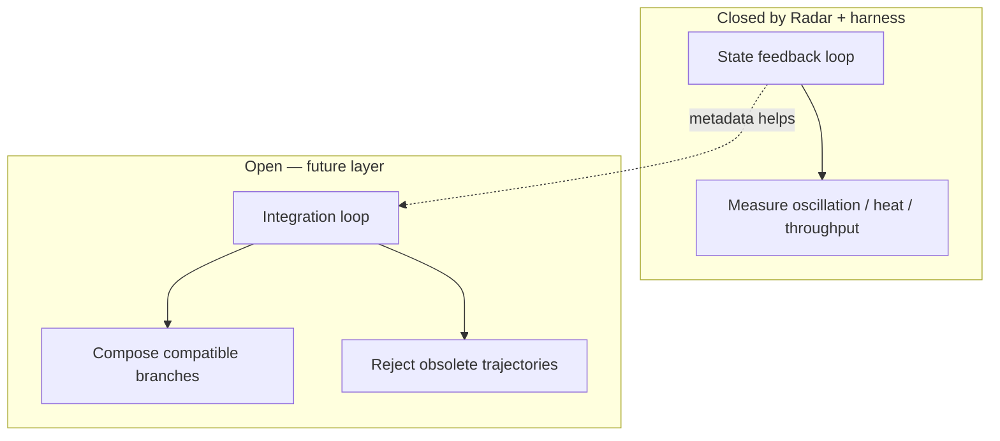

# Blaze Radar Harness

**Applying control theory to parallel AI agent systems:** measuring oscillation, damping, and throughput under shared state feedback.

A measurement harness for parallel AI coding agents.

---

## The problem

Modern agent systems don't fail only because agents make mistakes. They fail because independent workers repeatedly traverse the same state space:

- rediscovering known facts
- recreating abandoned fixes
- colliding without awareness

**Radar Harness** measures whether shared state feedback reduces repeated trajectories while preserving throughput.

The goal is not zero mistakes. **The goal is damping.**

> Proximity in workspace ≠ collision. What matters is velocity through explored space.

**Theory:** [docs/RadarDynamics.md](docs/RadarDynamics.md)

---

## Stack positioning

```
blaze-radar          →  state awareness layer (sensor + board)
blaze-radar-harness  →  control theory + measurement framework (oscilloscope)
```

| | blaze-radar | blaze-radar-harness |
|--|-------------|---------------------|
| Role | Controller / sensor implementation | Instrumentation for system behavior |
| Analogy | Feedback path | Scope on the waveform |
| Scope | One coordination system | Any parallel agent setup you wire in |

This harness is not a leaderboard. It is an **experimental framework for measuring multi-agent dynamics** — usable against Radar today, adaptable to other feedback layers tomorrow.

---

## Control system model

Parallel agents are not failing because they lack a manager. They are failing because **state is created faster than it is shared** — multiple trajectories diverge, and there is no feedback path to converge them before energy is wasted re-exploring.

### State variable

Let **x(t)** be distance from a resolved system state (bug fixed, feature shipped, investigation closed):

```
x(t) ≥ 0     x → 0  as the system converges
```

This is not "agents in different directories." Two agents on `auth/` can both reduce **x** if their velocity vectors traverse *new* state informed by shared history.

### Open loop: parallel trajectories without feedback

```
agent-01 ── fix A ──┐
                    ├──  ???  which partial state becomes truth?
agent-02 ── fix B ──┘
```

Without shared state **S(t)**:

```
agent acts  →  creates information I  →  I evaporates at session boundary
                                              ↓
other agent  →  retraces same region  →  oscillation in state space
```

Naive software response: **prevent both from working on it** (locks, assignment).  
Control response: **close the observation loop** so trajectories adjust before they repeat.

### Closed feedback loop (what Radar closes)

Radar is **sensor-only** — it does not actuate merges, assign work, or block edits:

```mermaid
flowchart LR
  subgraph workers [Parallel agents]
    A1[agent-01]
    A2[agent-02]
  end
  subgraph sensor [Radar — feedback path]
    S[(shared board S(t))]
  end
  subgraph plant [System under test]
    C[(codebase + git)]
  end
  A1 -->|edits| C
  A2 -->|edits| C
  A1 -->|sync, note| S
  A2 -->|sync, note| S
  S -->|observe before act| A1
  S -->|observe before act| A2
```

**Intended effect:** reduce repeated trajectories (oscillation) while preserving throughput (system energy).

A useful mental model — **analogy only, not a fitted ζ**:

```
ẋ(t) ≈ −k · progress(t)  +  disturbance(t)  −  heat(t)
```

| Term | Meaning | Harness proxy |
|------|---------|---------------|
| **progress(t)** | Steps that reduce **x** | useful commits, useful diffs, `convergence_score` numerator |
| **disturbance(t)** | Parallel exploration, merge friction | merge failures, conflicting work |
| **heat(t)** | Energy spent re-walking explored state | `waste_rate`, `duplicate_investigations`, abandoned commits |

We **do not** claim to measure a damping ratio ζ. Trials test whether feedback reduces **heat** at constant **energy** — the engineering question, not a physics certificate.

### Energy balance (what the harness scores)

Total agent effort (energy input):

```
E = agent_minutes_total
```

Partition into useful work and heat loss:

```
E = E_useful + Q_heat
Q_heat ≈ waste_rate · E        (when waste_rate is available from harness timestamps)
```

**Good damping outcome** (hypothesis under test):

```
E_radar ≈ E_no_radar          same energy in
Q_heat_radar < Q_heat_no_radar   less heat out
x_radar → 0 faster than x_no_radar   (qualitative — not directly measured as x)
```

Measured convergence proxy:

```
convergence_score = (useful_outputs + leverage − duplicate_work − merge_cost) / E
```

Higher **convergence_score** at similar **E** ⇒ more progress toward resolution per unit energy. Not coordination — **state convergence per joule**.

### Integration loop stays open (explicitly out of scope)

Feedback damping and branch **integration** are different problems:

| Loop | Question | Status |
|------|----------|--------|
| **State feedback** | Did agents know what was already tried? | Radar closes observation; harness measures |
| **Integration** | Which partial fixes compose into the next stable state? | **Open** — human merge / review today |

Two agents can both be right on different branches (validation fix + UX fix). The failure mode is no longer duplication — it is **composition**: which trajectories combine, which conflict, which are obsolete?

That is traffic control, not gatekeeping — and it is **not this repo**. Radar metadata (intent, notes, failed paths) makes future integration easier; the harness does not implement it.



---

## Control theory → measured signals

| Domain | Control question | Scorer fields (verified in `lib/score_trial_v2.py`) |
|--------|------------------|------------------------------------------------------|
| **Oscillation** | Are agents retracing explored state? | `duplicate_investigations`, `cognitive_duplication_rate` |
| **Energy** | How much effort entered the system? | `agent_minutes.total`, `output_per_agent_hour` |
| **Heat** | How much effort was redundant? | `waste_rate`, `wasted_breakdown.duplicate_investigations` |
| **Damping** | Did feedback change trajectories? | `prior_context_utilization`, `compounding_events` (Radar arm) |
| **Convergence** | Progress per unit energy | `convergence_score` |

Arm comparison deltas (from score JSON `comparison` block):

- `waste_rate_delta`
- `duplicate_investigations_delta`
- `compounding_events_delta`
- `prior_context_utilization_delta`
- `convergence_score_lift_pct`

### Visualize a trial run

After scoring:

```bash
./harness/score-trial.sh --trial trial-002 --out ~/radar-harness/trial-002-score.json
python3 lib/plot_trial.py ~/radar-harness/trial-002-score.json
```

ASCII bars for waste rate, duplication, compounding — enough to eyeball **same energy, less heat** without pretending we have continuous x(t) telemetry.

### What we claim vs what we measure

| Claim | Verified? |
|-------|-----------|
| Radar captures state (tasks, notes) on a shared board | Yes — `blaze-radar` product behavior |
| Harness compares feedback vs no-feedback arms | Yes — `run-trial.sh` + `score_trial_v2.py` |
| Duplicate investigation detection | Heuristic — stdout/diffs/board text, not ground truth |
| Compounding / prior-context detection | Heuristic — language patterns in agent transcripts |
| Agent-minutes / waste_rate | Requires harness timestamps; UNKNOWN if missing |
| Damping ratio ζ | **No** — analogy only |
| Integration / merge composition | **No** — out of scope |
| Causal "Radar caused improvement" | Requires clean trials; scorer flags contamination gaps |

**Good damping:** same **E**, lower **Q_heat**, higher **convergence_score**.  
**Bad damping (over-damped):** lower **E**, zero duplicates — fear, not physics.

Territory spread is **diagnostic only**. Five agents on one auth bug with complementary vectors is a feature, not a failure.

---

## What ships here

| Piece | Purpose |
|-------|---------|
| `harness/` | Run parallel agents in worktrees — feedback arm vs control arm |
| `lib/score_trial_v2.py` | Oscillation / energy / damping metrics from frozen artifacts |
| `prompts/` | Frozen agent instructions (overlap + swarm packs) |
| `protocol/` | Experiment contract — constants, variables, harness boundaries |

Typical experiment:

```
Claude Code × N + shared state feedback   vs   Claude Code × N, isolated
```

---

## Prerequisites

1. **[blaze-radar](https://github.com/Mikedan37/blaze-radar)** — demo CLI + daemon:

   ```bash
   git clone https://github.com/Mikedan37/blaze-radar.git
   cd blaze-radar && swift build -c release
   export PATH="$PWD/.build/release:$PATH"
   blaze-radar-demo-daemon &
   ```

2. **Claude Code** (`claude` on PATH)
3. **Target git repo** — any repo (SeekerWebsite was used in Trial 1)
4. **Python 3** — for the scorer

---

## Quick start

```bash
git clone https://github.com/Mikedan37/blaze-radar-harness.git
cd blaze-radar-harness

# Feedback arm (Radar)
./harness/run-trial.sh --mode radar --trial trial-002-radar --repo ~/YourRepo

# Control arm (no shared state)
./harness/run-trial.sh --mode no-radar --trial trial-002-no-radar --repo ~/YourRepo

# Measure oscillation, energy, damping
./harness/score-trial.sh --trial trial-002 \
  --report ~/radar-harness/trial-002/trial-report.md
```

Defaults:

- Worktrees: `~/radar-trials/`
- Frozen artifacts: `~/radar-harness/`
- Radar CLI: `blaze-radar-demo` (`--radar-cli` to override)
- Host: `demo` (`--host projectblaze` for private ProjectBlaze installs)

---

## Layout

```
blaze-radar-harness/
├── README.md
├── docs/RadarDynamics.md       control theory framing
├── protocol/trial-1-protocol.md
├── harness/
│   ├── run-trial.sh
│   ├── collect-trial.sh
│   ├── score-trial.sh
│   └── setup-trial-1.sh
├── lib/score_trial_v2.py
│   plot_trial.py               ASCII chart from score JSON
└── prompts/
    ├── seeker-overlap-v1/
    └── seeker-swarm-v1/
```

---

## Harness boundary

During a trial, the orchestrator **must not** tell agents what others are doing. That is the feedback layer's job in the treatment arm — and nobody's job in the control arm.

| Safe | Not safe |
|------|----------|
| Worktrees, timers, collect, score | Mid-run orchestration |
| Post-hoc analysis | Progress summaries to agents |
| Frozen prompts | Task routing between agents |

See [protocol/trial-1-protocol.md](protocol/trial-1-protocol.md).

---

## Related

| Repo | Role |
|------|------|
| [blaze-radar](https://github.com/Mikedan37/blaze-radar) | State awareness layer (public) |
| **blaze-radar-harness** | Measurement framework (public) |
| ProjectBlaze / AgentCLI | Private production host (optional) |

---

## License

MIT. See [LICENSE](LICENSE).
