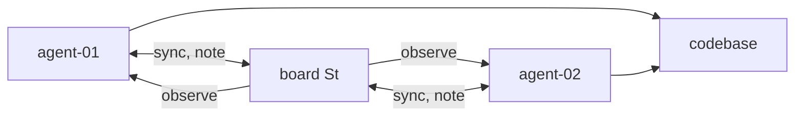

# Control model

Full equations and harness mapping for blaze-radar-harness. Operational Radar setup: [blaze-radar](https://github.com/Mikedan37/blaze-radar).

---

## 1. State and loops

**State variable** - distance from resolved system state:

```
x(t) ≥ 0 ,   x → 0  as bug fixed / feature shipped / investigation closed
```

**Loop 1 - State feedback (Radar + harness):** close the observation path so agents adjust trajectories before re-exploring.

**Loop 2 - Integration (out of scope):** compose partial fixes on different branches into one stable state. Humans do this at merge/review today. Radar metadata helps; no tool here closes this loop.

---

## 2. Open loop vs feedback

Without shared state **S(t)**:

```
agent acts → information I created → I lost at session edge
         → peer retraces region     → oscillation in state space
```

With Radar (sensor only - no actuators on edits/merges):

```
agent acts → sync/note → S(t) updated → peer observes → trajectory adjusts
```



---

## 3. Dynamics (analogy - not fitted ζ)

Inspired by damping, **not** a claim that we measure damping ratio ζ:

```
ẋ(t) ≈ −k · progress(t)  +  disturbance(t)  −  heat(t)
```

| Term | Meaning | Harness proxy |
|------|---------|---------------|
| `progress(t)` | Steps reducing x | useful commits, diffs, convergence numerator |
| `disturbance(t)` | Exploration + merge friction | merge failures, conflicting work |
| `heat(t)` | Redundant re-exploration | `waste_rate`, duplicate investigations |

**Proximity ≠ collision.** What matters is **velocity through explored space** - same directory + new informed vector is fine; same directory + blind retry is oscillation.

---

## 4. Energy balance (scored)

Total effort (energy input):

```
E = agent_minutes_total
```

Partition:

```
E = E_useful + Q_heat
Q_heat ≈ waste_rate · E
```

**Good damping hypothesis** (under test):

```
E_radar ≈ E_no_radar
Q_heat_radar < Q_heat_no_radar
convergence_score_radar > convergence_score_no_radar
```

**Convergence score** (not coordination score):

```
convergence_score = (useful_outputs + leverage − duplicate_work − merge_cost) / E
```

Interpretation: progress toward resolution **per unit energy**. Higher at similar E ⇒ less heat, more damping.

**Bad outcome (over-damped):** E collapses, duplicates → 0 - fear, not physics.

---

## 5. Measured signals

| Domain | Question | Scorer field |
|--------|----------|--------------|
| Oscillation | Retracing explored state? | `duplicate_investigations`, `cognitive_duplication_rate` |
| Energy | How much effort in? | `agent_minutes.total`, `output_per_agent_hour` |
| Heat | How much redundant? | `waste_rate`, `wasted_breakdown` |
| Damping | Did feedback change paths? | `prior_context_utilization`, `compounding_events` |
| Convergence | Progress per energy | `convergence_score` |

Arm comparison (`comparison` block): `waste_rate_delta`, `duplicate_investigations_delta`, `compounding_events_delta`, `convergence_score_lift_pct`.

---

## 6. What we claim vs measure

| Claim | Status |
|-------|--------|
| Feedback reduces heat at similar throughput | **Empirical** - see [EMPIRICAL_RESULTS.md](EMPIRICAL_RESULTS.md) |
| Duplicate detection | Heuristic (stdout/diffs/board text) |
| Compounding detection | Heuristic (transcript language) |
| Measured ζ | **No** - analogy only |
| Branch integration | **No** - future layer |

---

## 7. Generate charts

```bash
python3 lib/generate_trial_charts.py docs/trial-data/trial-*-score-v2.json
python3 lib/plot_trial.py docs/trial-data/trial-005-score-v2.json
```

See [EMPIRICAL_RESULTS.md](EMPIRICAL_RESULTS.md) for frozen SeekerWebsite trial artifacts.
