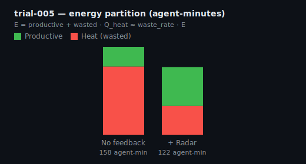
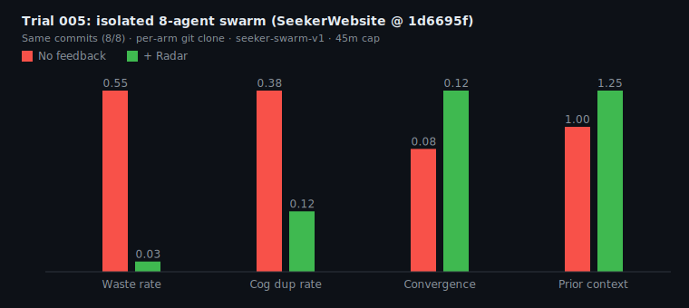
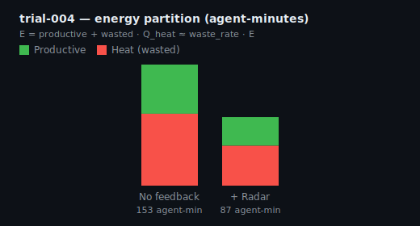
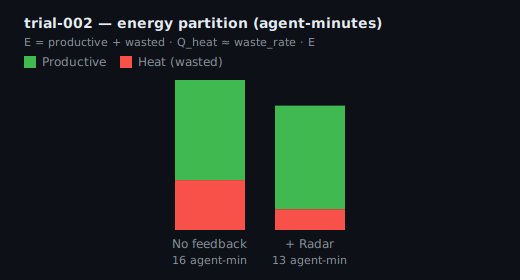
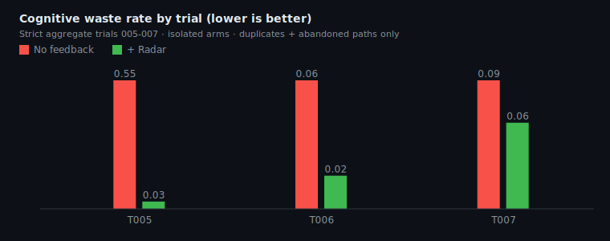

# Empirical results (frozen trials)

SeekerWebsite @ `1d6695f`, scorer v2. Artifacts in [`trial-data/`](trial-data/).

**Read first:** [CONTROL_MODEL.md](CONTROL_MODEL.md) for equations. Charts below are **observations**, not proof of ζ.

---

## Trial 005 — clean isolation (best A/B so far)

8-agent swarm (`seeker-swarm-v1`), per-arm `git clone --dissociate`, 45m cap, **0 cross-arm** prior-context events.

### Energy vs heat

Same throughput (8/8 commits). Radar arm: less wasted agent-minutes, lower waste rate.



### Oscillation & damping proxies



| Metric | No feedback | + Radar | Δ |
|--------|-------------|---------|---|
| Waste rate | 77.5% | 42.5% | **−35.0 pp** |
| Wasted agent-min | 122.3 | 51.7 | −58% |
| Duplicate topics | 7 | 5 | −29% |
| Same-arm prior context | 5 | 7 | +2 |
| Commits | 8/8 | 8/8 | same |
| Wall time | 19.7 min | 15.2 min | radar faster (n=1) |
| Convergence score | 0.055 | 0.070 | +26% lift |

**Control read:** `E` held (same commits), `Q_heat` down sharply — matches “same energy, less heat.”

**Qualitative damping** ([interpretation](trial-data/trial-005-interpretation.md)): agent-06 read board overlap on `UploadPageClient` → abandoned duplicate upload path → pivoted to signup. Trajectory change from feedback, not assignment.

---

## Trial 004 — mechanism yes, A/B contaminated

Sequential arms on shared `~/SeekerWebsite` — radar could cherry-pick no-radar branches. Validates **agents consume surfaced context**; invalidates arm comparison.



See [trial-004-interpretation.md](trial-data/trial-004-interpretation.md).

---

## Trial 002 — short overlap pack (3 agents)

Early run (~15 agent-min). Waste rate improved; duplication flat; Radar showed compounding events.



---

## Cross-trial waste rate



T004 delta is noisy (contamination + different E). **T005** is the headline clean signal.

---

## ASCII plot (terminal)

```bash
python3 lib/plot_trial.py docs/trial-data/trial-005-score-v2.json
```

---

## Batch in progress

Trials 006–010 were running locally for variance estimation (not yet in this folder when frozen). Re-run:

```bash
python3 lib/generate_trial_charts.py docs/trial-data/trial-*-score-v2.json
```

after copying new `*-score-v2.json` files into `docs/trial-data/`.
