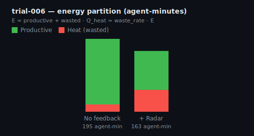

# Empirical results

Frozen A/B trials on SeekerWebsite @ git SHA `1d6695f`, scored with `score_trial_v2.py`. Raw JSON lives in [`trial-data/`](trial-data/).

**How to read this page:** Each trial compares a **Radar arm** (shared board) to a **no-Radar arm** (isolated agents). Headline metric is **duplicate investigations**. Throughput must hold (commits). Theory and formulas: [CONTROL_MODEL.md](CONTROL_MODEL.md).

---

## Strict aggregate (n = 3): trials 005, 006, 007

Isolated arms (`git clone --dissociate` per arm), 8 agents, `seeker-swarm-v1`, 45 minute cap, board v1.0.

> **Blaze Radar reduced duplicate AI investigation by ~59% while maintaining 8/8 commits every run.**

| Trial | Dup topics (NR → R) | Cog waste (NR → R) | Same-arm context | Wall (NR → R) | Commits |
|-------|---------------------|--------------------|------------------|---------------|---------|
| 005 | 3 → 1 | 54.7% → 3.1% | 5 → 10 | 19.7 → 15.2 min | 8/8 |
| 006 | 2 → 1 | 6.2% → 1.6% | 15 → 15 | 24.4 → 20.3 min | 8/8 |
| 007 | 5 → 2 | 9.4% → 6.3% | 11 → 13 | 19.4 → 18.4 min | 8/8 |


**007 is the most interesting:** misleading `activity: editing` UI, opaque IDs, no KNOWN STATE model. Still dups 5→2. Proves the primitive works before presentation is good. Trial 008 (board v1.1) pending.

---

## Trial 005 (first clean isolated A/B)

**Setup:** 8 agents, isolated git clone per arm, 45 minute cap.

| Metric | No Radar | With Radar | Change |
|--------|----------|------------|--------|
| Duplicate topics | 3 | 1 | −67% |
| Cognitive waste rate | 54.7% | 3.1% | −51.6 pp |
| Same-arm prior context | 5 | 10 | +5 |
| Commits | 8/8 | 8/8 | same |
| Wall time | 19.7 min | 15.2 min | −4.5 min |


**Example:** Agent 06 saw upload work on the board and pivoted instead of redoing it ([interpretation](trial-data/trial-005-interpretation.md)).

---

## Trial 006 (replication)

| Metric | No Radar | With Radar |
|--------|----------|------------|
| Duplicate topics | 2 | 1 |
| Cognitive waste rate | 6.2% | 1.6% |
| Commits | 8/8 | 8/8 |
| Wall time | 24.4 min | 20.3 min |



---

## Trial 007 (replication + presentation baseline)

| Metric | No Radar | With Radar |
|--------|----------|------------|
| Duplicate topics | 5 | 2 |
| Cognitive waste rate | 9.4% | 6.3% |
| Same-arm prior context | 11 | 13 |
| Commits | 8/8 | 8/8 |
| Wall time | 19.4 min | 18.4 min |


---

## Trial 004 (mechanism yes, comparison invalid)

Both arms ran sequentially against the same repo checkout. The Radar arm could see no-Radar branches, so arm deltas are contaminated.

**Still useful:** Agents did consume surfaced context (e.g. cherry-pick across trial branches). Proves the board is read; does not prove performance delta.


Details: [trial-004-interpretation.md](trial-data/trial-004-interpretation.md).

---

## Trial 002 (short 3-agent overlap)

Early ~15 agent-minute run. Exploratory, not headline.


---

## Cognitive waste across strict trials


---

## Reproduce charts locally

```bash
python3 lib/generate_trial_charts.py docs/trial-data/trial-005-score-v2.json \
  docs/trial-data/trial-006-score-v2.json docs/trial-data/trial-007-score-v2.json
```

Copy new `*-score-v2.json` files into `docs/trial-data/` after each batch run.

---

## Experiment phases

| Phase | Trials | Valid for thesis? |
|-------|--------|-------------------|
| Smoke / exploratory | 001, 002 | No |
| Mechanism demo | 004 | No (cross-arm git leak) |
| **Clean isolated A/B** | **005, 006, 007** | **Yes (n=3)** |
| Presentation A/B | 008 | Pending (board v1.1) |
| Discarded | 009, 010 | No (session limits) |
